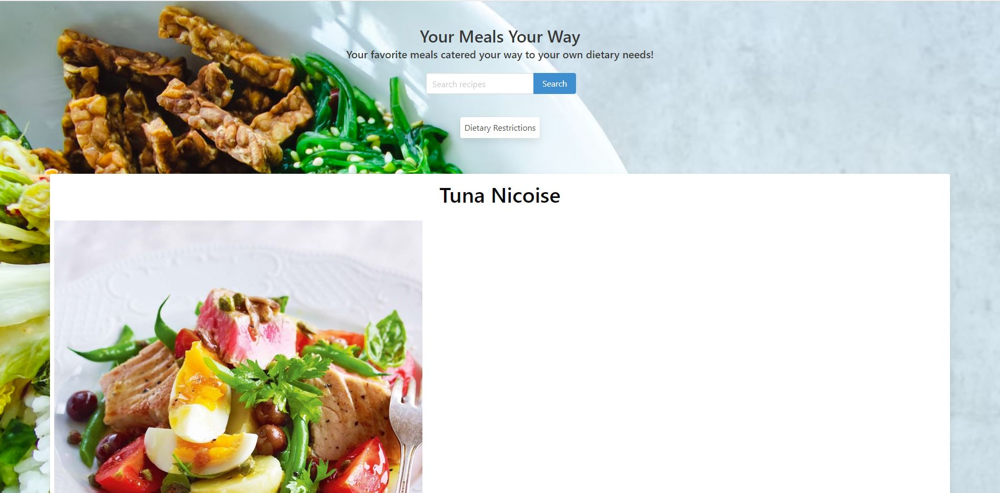
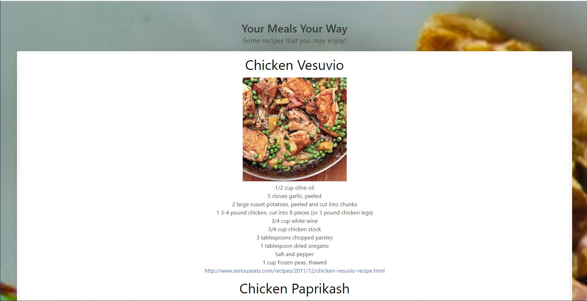
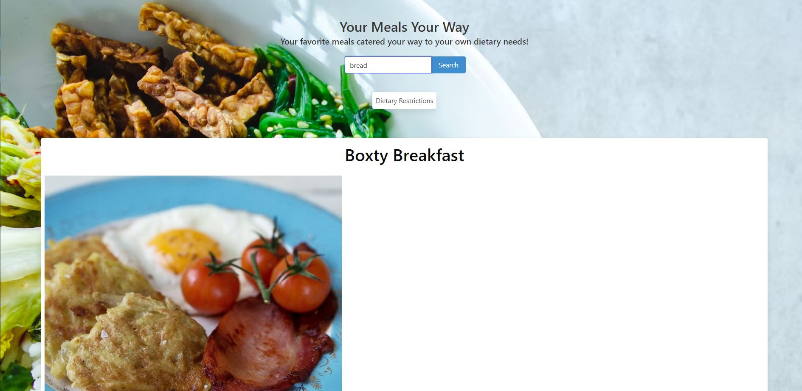
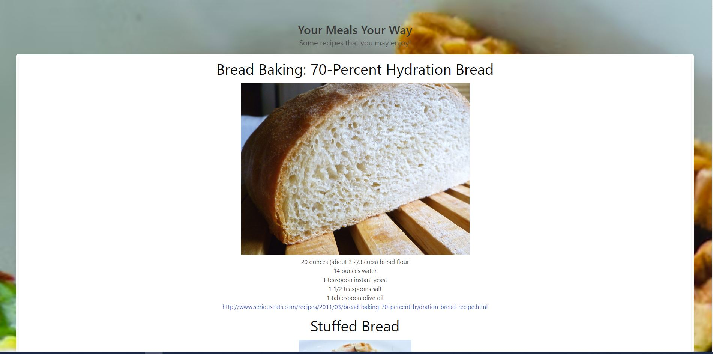

# nutrition-recipies-

Link to application: https://agnellod.github.io/nutrition-recipies-/
Link to GitHub Repository: https://github.com/agnellod/nutrition-recipies- 

# USER STORY

As a busy parent with crazy kids, 
I WANT to find quick and easy recipes to fit my dietary needs 
SO THAT I can maintain sanity, health and peace of mind. 

GIVEN a recipe selector that can filter based on individual dietary preferences

WHEN I put in a food selection into the input area
THEN I can select from the dietary restrictions drop down menu. 
WHEN I click search 
THEN I am presented with ten recipes that fit within the searched dietary and food categories.
WHEN I search for additional dietary or food options
THEN I am presented with ten more dietary and/or food recipes associated with that search.
WHEN I refresh the screen
THEN previously searched recipes are stored within local storage. 

## Mock-Up

The following images show the web application's appearance and functionality:

## Project Requirements

Group

Dylan
Matthew
Jessica
Chelsey 